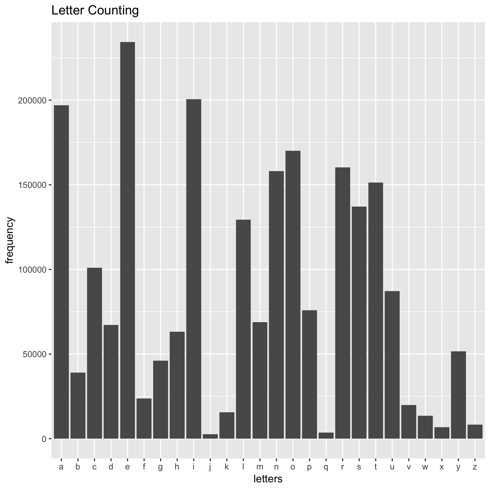

```{r load-hist-dat, include = FALSE}
letter_dat <- read.delim("letterCount.tsv")
```


I counted the number of each letters in word.txt, and write the result into letterCount.tsv


Here is a histogram of letter counting in word.txt



The most frequent letter in word.txt is `r with(letter_dat, letters[which.max(x)])`, which goes to about 230000

The least frequent letter in word.txt is `r with(letter_dat, letters[which.min(x)])`, which only has about 2500