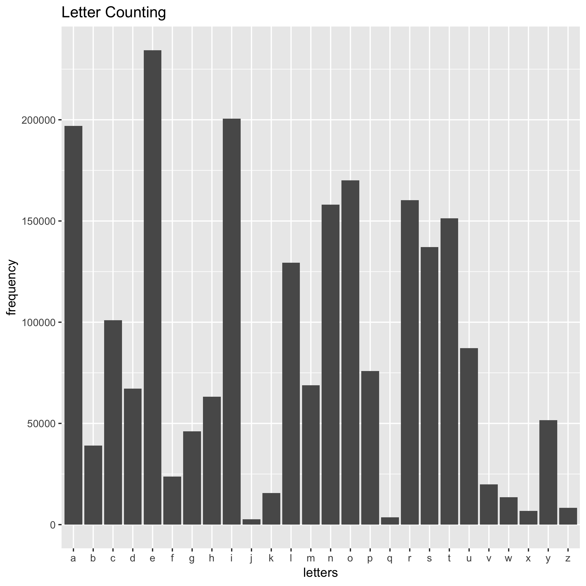

I counted the number of each letters in word.txt, and write the result into letterCount.tsv

Here is a histogram of letter counting in word.txt

The most frequent letter in word.txt is e, which goes to about 230000

The least frequent letter in word.txt is j, which only has about 2500
